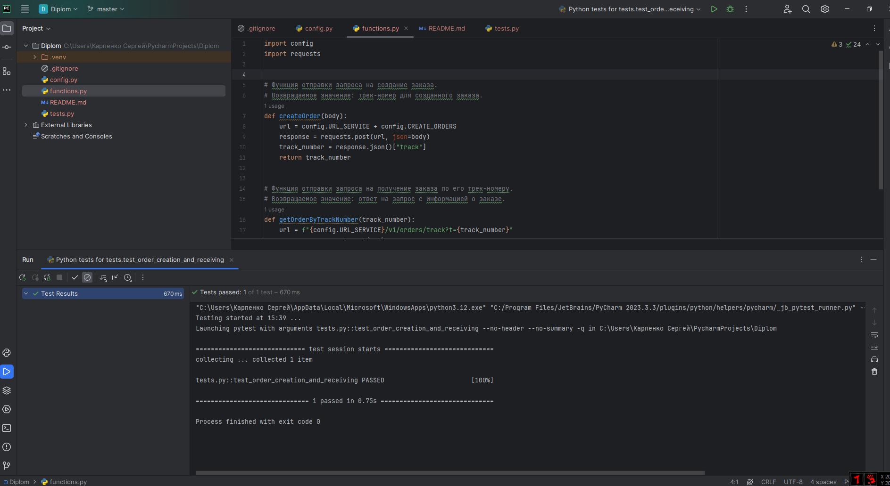

# Дипломный проект по курсу Яндекс.Практикума - инженер тестирования плюс.

# [Задания и решения](Questions.md)

# Автоматизация теста к API

## Задание
Теперь автоматизируй сценарий, который подготовили коллеги-тестировщики:
* Клиент создает заказ.
* Проверяется, что по треку заказа можно получить данные о заказе.

Шаги автотеста:
* Выполнить запрос на создание заказа.
* Сохранить номер трека заказа.
* Выполнить запрос на получения заказа по треку заказа.
* Проверить, что код ответа равен 200.

Технические примечания:
* К проекту добавь файлы .gitignore и README.MD .
* Логи лежат в файле error.log в папке /var/www/backend/logs.

## Описание решения
URL API запросов, данные POST-запросов хранятся в файле `config.py`,

Отправка запросов в файле `functions.py` содержит функции:
- `createOrder` - отправляет запрос на создание заказа и возвращает трек-номер для данного заказа;
- `getOrderByTrackNumber` - отправляет запрос на получение информации о заказе
по его трек-номеру и возвращает информацию о заказе.

Тест находится в файле `tests.py`
Тест `test_order_creation_and_receiving` на проверку создания нового заказа и 
получения информации о нём по его трек-номеру.

## Запуск тестов
- Для запуска тестов должны быть установлены пакеты `pytest` и `requests`.
- Для запуска теста необходимо подставить действующую ссылку на сервер приложения Яндекс Самокат в файле 
`config.py`, в поле `URL_SERVICE`
- Запуск всех тестов осуществляется через конфигурацию `test_run`

